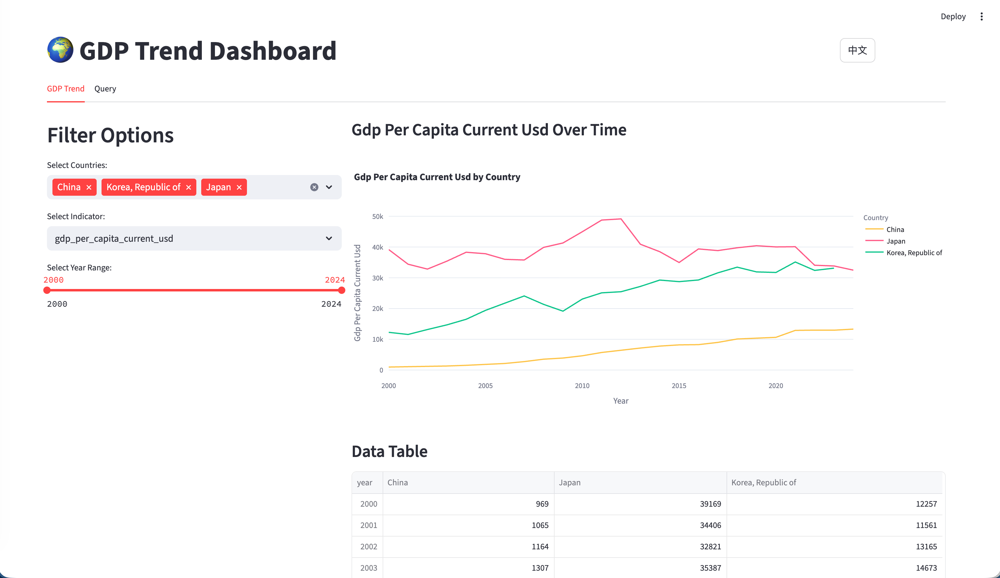
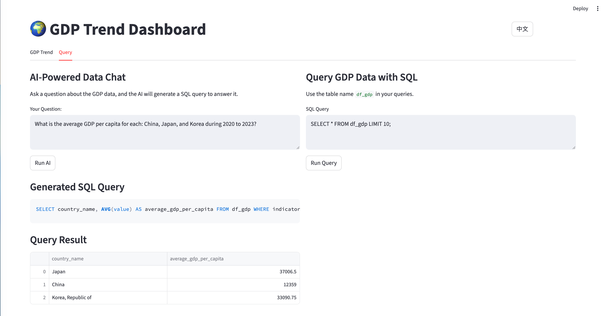
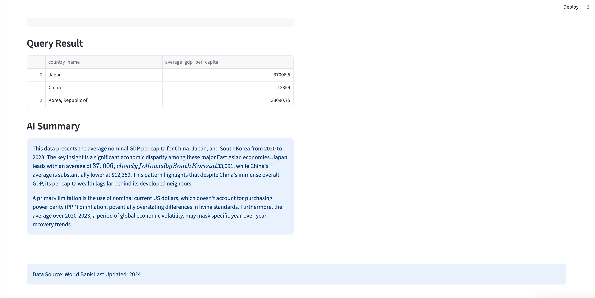

[English](README.md) | [中文](_README_CN.md)

# GDP Trend Dashboard 🌍

An interactive web application for visualizing and analyzing economic data from the World Bank API. This dashboard allows users to explore GDP trends, population data, and economic indicators for countries worldwide with AI-powered analytics.



## AI writing SQL code



## AI writing summary for the data



## Live Demo

https://world-GDP-trend.streamlit.app/

## Features

- 📊 **Interactive Visualizations**: Explore GDP, GDP per capita, and population trends over time
- 🗺️ **Global Coverage**: Data for all countries with continent filtering
- 🔍 **SQL Query Interface**: Direct database querying with DuckDB integration
- 🤖 **AI-Powered Analytics**: Natural language to SQL conversion using ModelScope API
- 📈 **Year-over-Year Growth**: Automatic calculation of GDP per capita growth rates
- 🌐 **Multilingual Support**: Country names in English and Chinese
- 💾 **Data Persistence**: Session-based query result storage

## Quick Start

### Prerequisites

- Python 3.8+
- pip package manager

### Installation

1. **Clone the repository**
   
   ```bash
   git clone <repository-url>
   cd GDP_trend
   ```

2. **Install dependencies**
   
   ```bash
   pip install streamlit pandas plotly duckdb openai python-dotenv wbgapi pycountry quarto
   ```

3. **Set up API key**
   
   Create a `.env` file in the project root:
   
   ```env
   modelscope=your_api_key_here
   ```
   
   Get your API key from [ModelScope](https://modelscope.cn).

4. **Download the data**
   
   ```bash
   python download_data.py
   ```
   
   This will download the latest economic data from the World Bank API and save it to the `data/` directory.

5. **Run the application**
   
   ```bash
   streamlit run app.py
   ```

The dashboard will open in your web browser at `http://localhost:8501`.

## Usage

### GDP Trend Visualization

1. Select countries from the dropdown (default: China, Japan, South Korea)
2. Choose an economic indicator (GDP, GDP per capita, population, or YoY growth)
3. Adjust the year range using the slider
4. View interactive line charts and data tables

### SQL Query Interface

- Use the `df_gdp` table name in your SQL queries
- Examples:
  
  ```sql
  SELECT * FROM df_gdp WHERE country_code_3 = 'CHN' AND year >= 2020
  SELECT country_name, AVG(value) as avg_gdp FROM df_gdp WHERE indicator = 'gdp_per_capita_current_usd' AND year >= 2020 GROUP BY country_name ORDER BY avg_gdp DESC
  ```

### AI-Powered Data Chat

Ask questions in natural language:

- "What is the average GDP per capita for China, Japan, and Korea from 2020 to 2023?"
- "Which countries had the highest GDP growth in 2023?"
- "Show me population trends for Asian countries"

The AI will generate and execute SQL queries to answer your questions.

## Project Structure

```
GDP_trend/
├── app.py                          # Main Streamlit application
├── download_data.py               # Python script for data download
├── language.py                     # Language translation module
├── streamlit_design.md             # Design specifications
├── data/
│   ├── all_countries_with_iso_continents.csv  # Country metadata
│   └── gdp_data_2000_present.csv              # Economic indicators data
├── CLAUDE.md                       # Development guidance for Claude Code
├── README.md                       # This file (English)
├── README_CN.md                    # Chinese version of README
├── favicon.svg                     # Application icon
└── .env                           # Environment variables (create this)
```

## Data Sources

- **World Bank API**: Economic indicators (GDP, GDP per capita, population)
- **pycountry**: Country codes and names
- **Time Range**: 2000 to present (updated annually)
- **Update Frequency**: Manual via data download script

## Available Indicators

- `gdp_current_usd`: GDP at market prices (current US$)
- `gdp_per_capita_current_usd`: GDP per capita (current US$)
- `population_total`: Total population
- `gdp_per_capita_current_usd_yoy`: Year-over-year GDP per capita growth rate (calculated)

## API Integration

### World Bank API

- Accessed via the `wbgapi` Python package
- Rate limiting implemented with delays between requests
- Automatic error handling for missing data

### ModelScope API

- Used for AI-powered SQL generation and data analysis
- Base URL: `https://api-inference.modelscope.cn/v1`
- Models:
  - `Qwen/Qwen3-Coder-480B-A35B-Instruct` for SQL generation
  - `Qwen/Qwen3-Next-80B-A3B-Instruct` for data analysis

**Data Source**: World Bank
