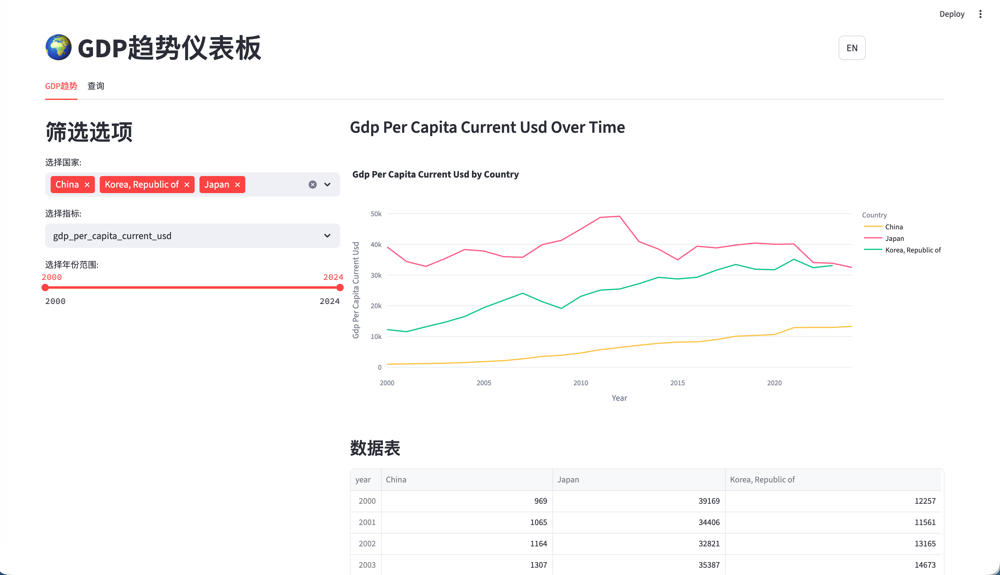
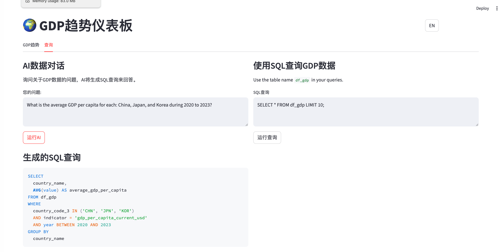
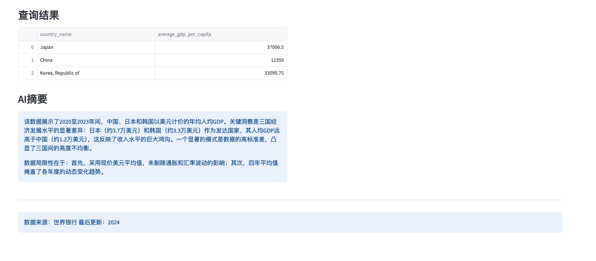

[English](README.md) | [中文](_README_CN.md)

# GDP趋势仪表板 🌍

一个用于可视化和分析来自世界银行API的经济数据的交互式Web应用程序。该仪表板允许用户探索全球国家的GDP趋势、人口数据和各经济指标，并支持AI驱动的分析功能。





## AI写SQL




## AI写数据总结




## 在线演示

https://world-GDP-trend.streamlit.app/


## 功能特性

- 📊 **交互式可视化**：探索GDP、人均GDP、PPP GDP和人口随时间的变化趋势
- 🗺️ **全球覆盖**：包括台湾在内的200+个国家和地区的数据，支持大洲筛选
- 🔍 **SQL查询界面**：直接通过DuckDB进行数据库查询
- 🤖 **AI驱动分析**：使用ModelScope API将自然语言转换为SQL查询并进行数据分析
- 📈 **同比增长率**：自动计算人均GDP的年度增长率
- 🌐 **多语言支持**：完整的中英文界面，包括国家名称翻译
- 💾 **数据持久化**：基于会话的查询结果存储
- 🌏 **多源数据**：整合世界银行API和IMF DataMapper数据

## 快速开始

### 前提条件

- Python 3.8+
- pip包管理器

### 安装步骤

1. **克隆仓库**
   ```bash
   git clone <repository-url>
   cd GDP_trend
   ```

2. **安装依赖项**
   ```bash
   pip install streamlit pandas plotly duckdb openai python-dotenv wbgapi pycountry
   ```

3. **设置API密钥**

   在项目根目录下创建 `.env` 文件：
   ```env
   modelscope=your_api_key_here
   ```

   从 [ModelScope](https://modelscope.cn) 获取您的API密钥。

4. **下载数据**
   ```bash
   python download_data.py
   ```
   这将从世界银行API下载最新的经济数据并保存到 `data/` 目录中。

5. **运行应用程序**
   ```bash
   streamlit run app.py
   ```

   仪表板将在您的Web浏览器中打开，地址为 `http://localhost:8501`。

## 使用方法

### GDP趋势可视化
1. 从下拉菜单中选择国家（默认：中国、日本、韩国）
2. 选择一个经济指标：
   - GDP（现价美元）
   - 人均GDP（现价美元）
   - 总GDP PPP（购买力平价）
   - 人均GDP PPP
   - 总人口
   - 人均GDP同比增长率（%）
3. 使用滑块调整年份范围（2000-2024）
4. 查看交互式折线图和数据表

### SQL查询界面
- 在您的SQL查询中使用 `df_gdp` 表名
- 示例：
  ```sql
  SELECT * FROM df_gdp WHERE country_code_3 = 'CHN' AND year >= 2020
  SELECT country_name, AVG(value) as avg_gdp FROM df_gdp WHERE indicator = 'gdp_per_capita_current_usd' AND year >= 2020 GROUP BY country_name ORDER BY avg_gdp DESC
  ```

### AI驱动的数据对话
用自然语言提问：
- "2020年至2023年期间，中国、日本和韩国的平均人均GDP是多少？"
- "2023年哪些国家的GDP增长最高？"
- "显示亚洲国家的人口趋势"

AI将生成并执行SQL查询来回答您的问题。

## 项目结构

```
GDP_trend/
├── app.py                          # 主要的Streamlit应用程序
├── download_data.py               # 数据下载脚本（世界银行 + IMF API）
├── language.py                     # 双语翻译模块
├── data/
│   ├── all_countries_with_iso_continents.csv  # 国家元数据
│   └── gdp_data_2000_present.csv              # 经济指标数据
├── images/                         # README截图
├── CLAUDE.md                       # Claude代码开发指导
├── README.md                       # 英文版本文档
├── _README_CN.md                   # 中文版本文档（本文件）
├── favicon.svg                     # 应用程序图标
├── requirements.txt                # Python依赖项
└── .env                           # 环境变量（需创建）
```

## 数据来源

- **世界银行API**：200+个国家的经济指标
  - GDP（现价美元）
  - 人均GDP（现价美元）
  - PPP GDP（现价国际元）
  - 人均PPP GDP（现价国际元）
  - 总人口
- **IMF DataMapper API**：台湾经济数据
  - GDP、人均GDP、PPP GDP、人均PPP GDP和人口
- **pycountry**：ISO国家代码和名称
- **时间范围**：2000年至2024年
- **更新频率**：通过 `download_data.py` 脚本手动更新

## 可用指标

- `gdp_current_usd`：按市场价格计算的GDP（现价美元）
- `gdp_per_capita_current_usd`：人均GDP（现价美元）
- `gdp_ppp_current_intl`：基于购买力平价的GDP（现价国际元）
- `gdp_per_capita_ppp_current_intl`：基于购买力平价的人均GDP（现价国际元）
- `population_total`：总人口
- `gdp_per_capita_current_usd_yoy`：人均GDP同比增长率（%，计算得出）

## API集成

### 世界银行API
- 通过 `wbgapi` Python包访问
- 在请求之间实现延迟进行速率限制
- 对缺失数据自动进行错误处理
- 覆盖200+个国家和地区

### IMF DataMapper API
- 直接REST API调用获取台湾经济数据
- 基础URL：`https://www.imf.org/external/datamapper/api/v1`
- 提供台湾的GDP、PPP GDP和人口数据（2000-2024）

### ModelScope API
- 用于AI驱动的SQL生成和数据分析
- 基础URL：`https://api-inference.modelscope.cn/v1`
- 模型：`ZhipuAI/GLM-4.6` 用于SQL生成和数据摘要生成
- 支持双语输出（中文/英文）

## 开发

### 运行测试
```bash
# 测试数据下载过程
python download_data.py

# 测试Streamlit应用程序
streamlit run app.py
```

### 更新数据
要使用最新的世界银行数据刷新经济数据：
```bash
python download_data.py
```

### 自定义
- 修改 `download_data.py` 来更改时间范围或添加新指标
- 更新 `app.py` 来自定义仪表板布局或添加新可视化
- 更新 `language.py` 来添加新语言或修改翻译
- 在数据下载脚本中扩展国家映射以支持更多地区

## 故障排除

### 常见问题

1. **"找不到数据文件"错误**
   - 运行 `python download_data.py` 首先下载数据

2. **"找不到API密钥"错误**
   - 创建包含您的ModelScope API密钥的 `.env` 文件
   - 确保密钥有效且有足够余额

3. **空的可视化**
   - 检查 `data/` 目录中是否存在数据文件
   - 验证所选筛选器与可用数据匹配

4. **SQL查询错误**
   - 在所有查询中使用表名 `df_gdp`
   - 检查数据架构中的列名
   - 确保SQL语法正确

### 获取帮助

- 使用 `SELECT * FROM df_gdp LIMIT 5;` 检查数据架构
- 使用"显示原始数据"复选框检查筛选后的数据
- 查看AI生成的SQL查询以进行学习

## 许可证

本项目按原样提供，仅用于教育和研究目的。请确保遵守世界银行API服务条款和ModelScope API使用政策。

## 贡献

欢迎贡献！请随时提交拉取请求或创建问题，内容可包括：
- 新的经济指标
- UI/UX改进
- 错误修复
- 文档更新

---

**数据来源**：世界银行
**最后更新**：2024年
**技术栈**：Python、Streamlit、Plotly、DuckDB、ModelScope API